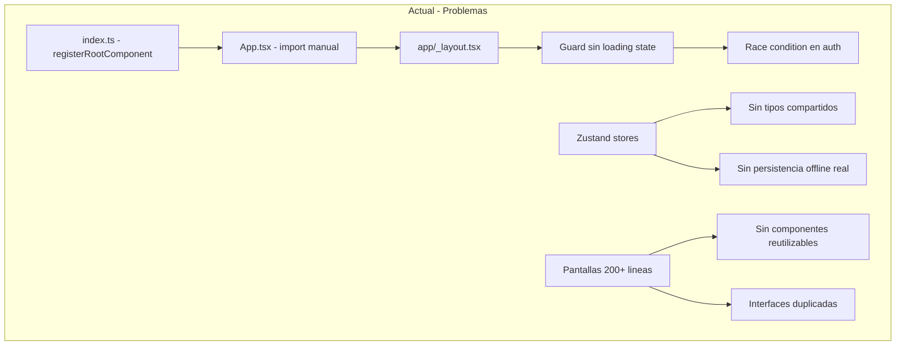
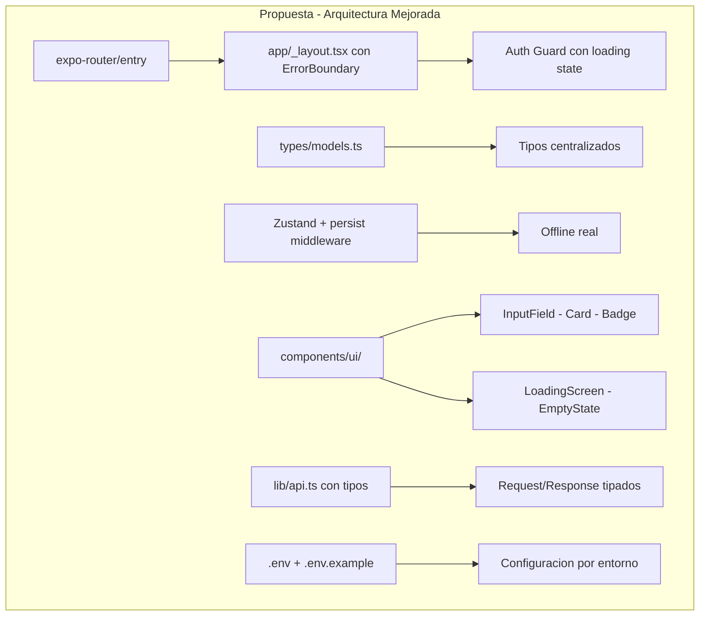

# 🔍 Análisis de Arquitectura — CampoApp (React Native / Expo)

## Resumen Ejecutivo

Se revisaron **todos los archivos** de la aplicación. Se encontraron **19 fallas** clasificadas en 4 niveles de severidad: Crítica, Alta, Media y Baja.

---

## 🔴 FALLAS CRÍTICAS (Rompen la app o causan bugs graves)

### 1. Conflicto entre Expo Router y entry point manual

**Archivos:** [`App.tsx`](App.tsx), [`index.ts`](index.ts), [`app/_layout.tsx`](app/_layout.tsx)

Expo Router usa file-based routing y espera que el entry point sea manejado por el framework. Sin embargo, tienes:

- [`index.ts`](index.ts) que llama a `registerRootComponent(App)`
- [`App.tsx`](App.tsx) que importa directamente `RootLayout` desde `app/_layout.tsx`

Esto **bypasea completamente** el sistema de routing de Expo Router. El `<Stack />` dentro de [`_layout.tsx`](app/_layout.tsx:42) no descubrirá automáticamente las rutas porque no está siendo montado por el framework sino manualmente.

**Solución:** Eliminar `App.tsx` y cambiar `index.ts` para usar `expo-router/entry` como entry point, o configurar `"main": "expo-router/entry"` en [`package.json`](package.json:4).

---

### 2. Animated values creadas dentro del render (memory leak + animaciones rotas)

**Archivos:** [`app/auth/splash.tsx:9-10`](app/auth/splash.tsx:9), [`app/auth/conexion.tsx:18`](app/auth/conexion.tsx:18)

```typescript
// splash.tsx - DENTRO del componente, se recrea en cada render
const fadeAnim = new Animated.Value(0)
const scaleAnim = new Animated.Value(0.3)
```

Cada vez que el componente re-renderiza, se crean **nuevas instancias** de `Animated.Value`, perdiendo el estado de la animación y causando memory leaks.

**Solución:** Usar `useRef` para mantener la referencia estable:
```typescript
const fadeAnim = useRef(new Animated.Value(0)).current
const scaleAnim = useRef(new Animated.Value(0.3)).current
```

---

### 3. `JSON.parse` sin protección en detalle-asignacion

**Archivo:** [`app/stack/detalle-asignacion.tsx:14`](app/stack/detalle-asignacion.tsx:14)

```typescript
const item = JSON.parse(params.data as string)
```

Si `params.data` es `undefined` o un string malformado, la app **crashea inmediatamente**. Esto puede pasar si el usuario navega directamente a la URL o si hay un deep link.

**Solución:** Envolver en try/catch y validar que `params.data` existe antes de parsear.

---

### 4. Dependencia faltante: `react-native-signature-canvas`

**Archivo:** [`app/stack/firma.tsx:7`](app/stack/firma.tsx:7)

```typescript
import SignatureCanvas from 'react-native-signature-canvas'
```

Esta dependencia **no está en** [`package.json`](package.json). La app crasheará al intentar abrir la pantalla de firma.

**Solución:** Instalar `react-native-signature-canvas` o usar una alternativa compatible con Expo.

---

### 5. Dependencia faltante: `zustand`

**Archivo:** [`hooks/useAuth.ts:1`](hooks/useAuth.ts:1)

```typescript
import { create } from 'zustand'
```

`zustand` **no está listado** en [`package.json`](package.json). Todos los hooks de estado global (`useAuth`, `useBitacora`, `usePreload`, `useNotifications`) dependen de él.

**Solución:** Instalar `zustand` como dependencia.

---

## 🟠 FALLAS DE SEVERIDAD ALTA (Causan comportamiento inesperado)

### 6. Loop infinito en Dashboard por dependencia circular

**Archivo:** [`app/tabs/dashboard.tsx:65`](app/tabs/dashboard.tsx:65)

```typescript
useEffect(() => { cargar() }, [asignacionesCache])
```

La función [`cargar()`](app/tabs/dashboard.tsx:36) llama a [`actualizarAsignaciones()`](app/tabs/dashboard.tsx:51) que modifica `asignacionesCache` en el store de Zustand, lo cual **dispara de nuevo** el `useEffect`, creando un loop infinito de peticiones al servidor.

**Solución:** Separar la lógica de carga inicial de la actualización, o usar un flag para evitar re-ejecuciones.

---

### 7. Guard de autenticación incompleto y con race condition

**Archivo:** [`app/_layout.tsx:13-37`](app/_layout.tsx:13)

```typescript
useEffect(() => {
  cargarSesion()  // Async - no se espera
}, [])

useEffect(() => {
  // Se ejecuta ANTES de que cargarSesion termine
  if (!usuario && !enAuth) {
    router.replace('/index')
  }
}, [usuario, segments])
```

`cargarSesion()` es async pero no se espera. El segundo `useEffect` se ejecuta inmediatamente con `usuario = null`, redirigiendo al usuario al index incluso si tiene sesión guardada.

**Solución:** Agregar un estado `cargandoSesion` y no evaluar el guard hasta que la sesión se haya cargado.

---

### 8. Interceptor 401 no actualiza el estado de Zustand

**Archivo:** [`lib/api.ts:22-31`](lib/api.ts:22)

```typescript
api.interceptors.response.use(
  (res) => res,
  async (error) => {
    if (error.response?.status === 401) {
      await SecureStore.deleteItemAsync('auth_token')
      await SecureStore.deleteItemAsync('user_data')
      // Solo limpia SecureStore, NO limpia el estado de Zustand
    }
    return Promise.reject(error)
  }
)
```

Cuando el servidor responde 401, se limpian los tokens del storage pero **el estado de Zustand sigue teniendo** `usuario` y `token`. El guard de autenticación no se activa porque `usuario` no es `null`.

**Solución:** Importar y llamar `useAuth.getState().logout()` o al menos `useAuth.setState({ usuario: null, token: null })`.

---

### 9. Pasar datos completos como JSON en params de navegación

**Archivo:** [`app/tabs/dashboard.tsx:76-78`](app/tabs/dashboard.tsx:76)

```typescript
router.push({
  pathname: '/stack/detalle-asignacion',
  params: { id: String(item.id_asignacion), data: JSON.stringify(item) },
})
```

Pasar objetos JSON serializados como parámetros de navegación es **anti-patrón** en React Navigation/Expo Router. Causa:
- URLs extremadamente largas
- Problemas con deep linking
- Límites de tamaño en algunos dispositivos
- Pérdida de tipos TypeScript

**Solución:** Pasar solo el `id` y obtener los datos del store de Zustand o hacer fetch en la pantalla de destino.

---

### 10. `finalizarBitacora` se llama pero el estado no se refleja inmediatamente

**Archivo:** [`app/stack/satisfaccion.tsx:41-43`](app/stack/satisfaccion.tsx:41)

```typescript
finalizarBitacora(loc.coords.latitude, loc.coords.longitude)
const state = useBitacora.getState() // Lee el estado ANTES de que Zustand actualice
```

Zustand actualiza sincrónicamente, pero la lectura inmediata después de `set()` puede no reflejar el nuevo estado en el mismo tick si hay batching de React.

**Solución:** Usar directamente los valores de `loc.coords` en lugar de leer del store.

---

## 🟡 FALLAS DE SEVERIDAD MEDIA (Afectan calidad y mantenibilidad)

### 11. Interfaces duplicadas sin tipado centralizado

**Archivos:** [`hooks/usePreload.ts:6-15`](hooks/usePreload.ts:6), [`app/tabs/dashboard.tsx:13-23`](app/tabs/dashboard.tsx:13)

La interfaz `Asignacion` está definida **dos veces** con la misma estructura. No hay un directorio `types/` o `models/` centralizado.

**Solución:** Crear `types/models.ts` con todas las interfaces compartidas.

---

### 12. Directorio `components/` vacío — cero reutilización

**Directorio:** `components/bitacora/`, `components/layout/`, `components/ui/`

Los directorios existen pero están **completamente vacíos**. Toda la UI está inline en las pantallas, lo que causa:
- Código duplicado (inputs, badges, cards se repiten)
- Pantallas de 200+ líneas difíciles de mantener
- Imposibilidad de testing unitario de componentes

**Solución:** Extraer componentes reutilizables: `InputField`, `Badge`, `Card`, `LoadingScreen`, `EmptyState`, etc.

---

### 13. No hay manejo de errores global ni boundary

No existe un `ErrorBoundary` en ningún nivel de la app. Si cualquier componente lanza un error no capturado, la app se cierra sin feedback al usuario.

**Solución:** Agregar un `ErrorBoundary` en [`app/_layout.tsx`](app/_layout.tsx) que muestre una pantalla de error amigable.

---

### 14. Notificaciones son un stub vacío

**Archivo:** [`hooks/useNotifications.ts:62-64`](hooks/useNotifications.ts:62)

```typescript
enviarNotificacionLocal: async () => {},
programarRecordatoriosDiarios: async () => {},
cancelarTodosLosRecordatorios: async () => {},
```

Todas las funciones de notificaciones son **no-ops**. La pantalla de información dice "Modo Offline - Los datos se sincronizarán automáticamente" pero no hay implementación real de sincronización ni notificaciones.

**Solución:** Implementar o remover completamente el módulo para no confundir.

---

### 15. API usa `any` extensivamente — pérdida de type safety

**Archivo:** [`lib/api.ts:54-58`](lib/api.ts:54)

```typescript
crear: (datos: any) => api.post('/api/app/beneficiarios', datos)
crear: (datos: any) => api.post('/api/app/bitacoras', datos)
```

El uso de `any` en los parámetros de la API anula las ventajas de TypeScript. Errores de estructura de datos no se detectan en compilación.

**Solución:** Definir interfaces para cada request/response de la API.

---

### 16. Pantalla `configuracion-notificaciones` no está registrada en el Stack layout

**Archivo:** [`app/stack/_layout.tsx`](app/stack/_layout.tsx)

La pantalla [`configuracion-notificaciones.tsx`](app/stack/configuracion-notificaciones.tsx) existe pero **no tiene un `<Stack.Screen>`** definido en el layout. Expo Router podría manejarla por convención, pero no tendrá las opciones de header configuradas.

---

## 🔵 FALLAS DE SEVERIDAD BAJA (Mejoras recomendadas)

### 17. No hay `.env` ni configuración de entornos

**Archivo:** [`lib/api.ts:6`](lib/api.ts:6)

```typescript
const BASE_URL = process.env.EXPO_PUBLIC_API_URL ?? 'https://saderh.hidalgo.gob.mx'
```

La URL de producción está hardcodeada como fallback. No hay archivo `.env` ni `.env.example` en el proyecto.

**Solución:** Crear `.env` y `.env.example` con las variables de entorno necesarias.

---

### 18. Versión hardcodeada en múltiples lugares

**Archivos:** [`app/auth/splash.tsx:62`](app/auth/splash.tsx:62), [`app/tabs/informacion.tsx:58`](app/tabs/informacion.tsx:58)

La versión "v1.0.0" está escrita directamente en el JSX en lugar de leerse de [`app.json`](app.json:5).

**Solución:** Usar `expo-constants` para leer la versión dinámicamente.

---

### 19. Falta `react-native-gesture-handler` como dependencia

Para que `react-native-signature-canvas` y las navegaciones con gestos funcionen correctamente, generalmente se necesita `react-native-gesture-handler`, que no está en las dependencias.

---

## 📊 Diagrama de Arquitectura Actual vs Propuesta





---

## 📋 Plan de Corrección Priorizado

| # | Falla | Severidad | Acción |
|---|-------|-----------|--------|
| 1 | Entry point conflictivo | 🔴 Crítica | Cambiar a expo-router/entry |
| 2 | Dependencias faltantes zustand + signature-canvas | 🔴 Crítica | npm install |
| 3 | Animated values en render | 🔴 Crítica | Migrar a useRef |
| 4 | JSON.parse sin protección | 🔴 Crítica | Agregar try/catch |
| 5 | Race condition en auth guard | 🟠 Alta | Agregar estado de carga |
| 6 | Loop infinito en dashboard | 🟠 Alta | Refactorizar useEffect |
| 7 | Interceptor 401 incompleto | 🟠 Alta | Limpiar estado Zustand |
| 8 | Datos JSON en params | 🟠 Alta | Pasar solo IDs |
| 9 | Tipos centralizados | 🟡 Media | Crear types/models.ts |
| 10 | Componentes reutilizables | 🟡 Media | Extraer a components/ |
| 11 | ErrorBoundary | 🟡 Media | Implementar en root |
| 12 | Notificaciones stub | 🟡 Media | Implementar o remover |
| 13 | API tipada | 🟡 Media | Definir interfaces |
| 14 | Archivo .env | 🔵 Baja | Crear .env.example |
| 15 | Versión dinámica | 🔵 Baja | Usar expo-constants |
